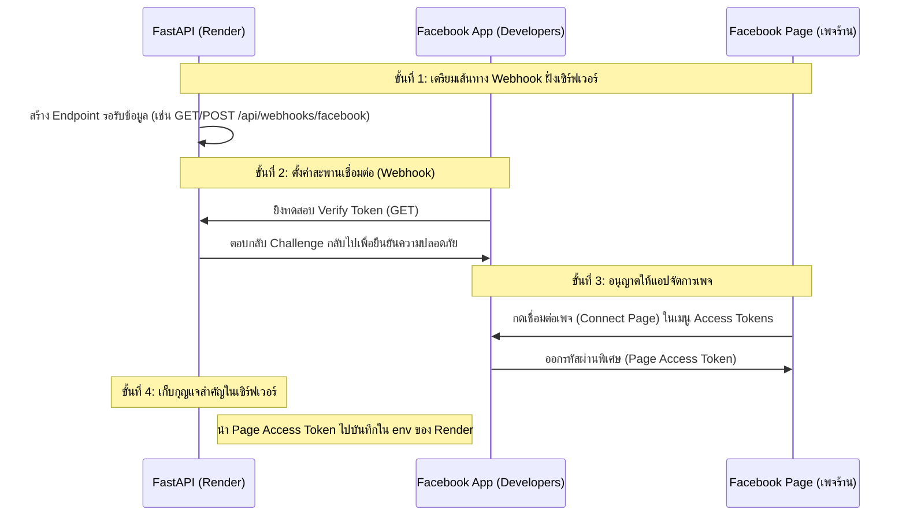

# Facebook & Shopee Affiliate Bot Architecture Guide

เอกสารนี้อธิบายการทำงานร่วมกันของส่วนประกอบต่าง ๆ (เพจ, แอปดีเวลลอปเปอร์, เซิร์ฟเวอร์บอท, คลังสินค้า) เพื่อให้คุณเข้าใจภาพรวมและนำไปเชื่อมต่อใช้งานจริงได้อย่างเข้าใจง่ายครับ

---

## 1. แผนผังการทำงานของระบบ (System Architecture)

นี่คือแผนผังแสดงการไหลของข้อมูลเมื่อลูกค้าส่งข้อความเข้ามาที่เพจ หรือเมื่อบอทต้องการโพสต์สินค้าอัตโนมัติ:

```mermaid
flowchart TD
    User([ลูกค้า / ผู้เข้าชมเพจ]) <-->|1. ส่งแชท / ดูโพสต์| FBPage[Facebook Page<br>ID: 1307380735783361]
    FBPage <-->|2. ส่งเหตุการณ์ / รับคีย์| FBApp[Facebook Developer App<br>ID: 1263958805236203]
    FBApp <-->|3. Webhook (HTTPS)| Backend[FastAPI Server<br>Render]

    subgraph Backend Server (สมองของบอท)
        Backend <-->|4. อ่าน/เขียนข้อมูล| DB[(Supabase Database)]
        Backend <-->|5. ประมวลผลคำสั่ง| LLM[LLM Engine<br>Groq / Claude]
        Backend -->|6. แปลงลิงก์ค่านายหน้า| Shopee[Shopee Affiliate SDK]
    end
```

---

## 2. หน้าที่ของส่วนประกอบแต่ละส่วน (Component Roles)

| ส่วนประกอบ | หน้าที่หลัก | สิ่งที่ต้องตั้งค่า/ดึงข้อมูลไปใช้ |
| :--- | :--- | :--- |
| **1. Facebook Page** *(เพจร้าน)* | ช่องทางหน้าร้านที่ลูกค้าใช้พิมพ์คุย หรือใช้สำหรับให้บอทโพสต์คอนเทนต์ขายของ | **Page ID** (`1307380735783361`) · ชื่อเพจ: `ป้าเข็ม ขายของ` |
| **2. Facebook App** *(ตัวเชื่อมต่อ)* | เป็นสะพานเชื่อมแชทและโพสต์ของเพจ ส่งข้อมูลไปยังเซิร์ฟเวอร์ และออกรหัสขออนุญาต | **App ID** (`1263958805236203`), **App Secret**, **Page Access Token** |
| **3. FastAPI Server (Render)** | "สมองส่วนคิด" รับเหตุการณ์จากเพจ (เช่น มีคนทักแชท) สั่งให้ AI คิดหาคำตอบ และส่งคำตอบกลับไปยังเพจ | **Webhook URL** (ลิงก์ HTTPS ของ Render เพื่อนำไปกรอกในหน้า App Settings) |
| **4. Supabase / SQLite** | "ความจำ" เก็บรายชื่อลูกค้า, ประวัติการคุย, และคลังสินค้า Shopee ที่มีลิงก์ Affiliate | **Database URL** |
| **5. LLM (Groq/Claude)** | "ความคิด" สำหรับวิเคราะห์ข้อความคำค้นหาของลูกค้า แล้วเลือกสินค้าที่ตรงงบประมาณ/หมวดหมู่ | **API Keys** |

---

## 3. ขั้นตอนการตั้งค่าเพื่อเชื่อมต่อทั้งหมดเข้าด้วยกัน (Step-by-Step Integration)

> ✅ **ขั้นที่ 1–2 ถูก implement แล้ว** ใน `backend/app/api/facebook_bot.py` — endpoint `GET/POST /api/webhooks/facebook`
> พร้อม verify token (GET ตอบ `hub.challenge`) + ตรวจ `X-Hub-Signature-256` (POST) ส่วนขั้นที่ 3–4 ยังต้องทำบนเว็บ Facebook เอง

หากคุณต้องการเชื่อมเพจ Facebook เข้ากับระบบบอทตัวเดิมของคุณ ให้ทำตาม 4 ขั้นตอนนี้ครับ:



---

## 4. แนวทางการนำไปต่อยอดใช้งาน (Extension Ideas)

เมื่อคุณเชื่อมต่อระบบข้างต้นสำเร็จ คุณสามารถพัฒนาฟีเจอร์เพิ่มความสะดวกได้ดังนี้:

### 🌟 ไอเดียที่ A: บอทตอบแชทเพจอัตโนมัติ (Messenger AI Agent)
* **การทำงาน:** เมื่อลูกค้าทักแชทเพจว่า *"ขอหูฟังบลูทูธราคาไม่เกิน 500 หน่อยครับ"*
* **ระบบทำงาน:** Facebook App จะโยนข้อความไปที่ FastAPI → ดึงสินค้าจาก Supabase → ให้ LLM เรียบเรียงแชท → บอทส่งลิงก์ Affiliate ตอบกลับลูกค้าในช่องแชททันที 24 ชั่วโมง

### 🌟 ไอเดียที่ B: โพสต์สินค้าแนะนำอัตโนมัติ (Auto-Scheduler)
* **การทำงาน:** ตั้งเวลา (Cron Job) บนเซิร์ฟเวอร์ ให้ทำงานทุกๆ 4 ชั่วโมง
* **ระบบทำงาน:** ดึงสินค้าที่มีค่านายหน้าดีจากฐานข้อมูล → ให้ LLM ช่วยเขียนแคปชั่นโปรโมทที่น่าสนใจ → ใช้สคริปต์ยิง API สั่งโพสต์ลงเพจ Facebook อัตโนมัติโดยที่แอดมินไม่ต้องกดโพสต์เอง
