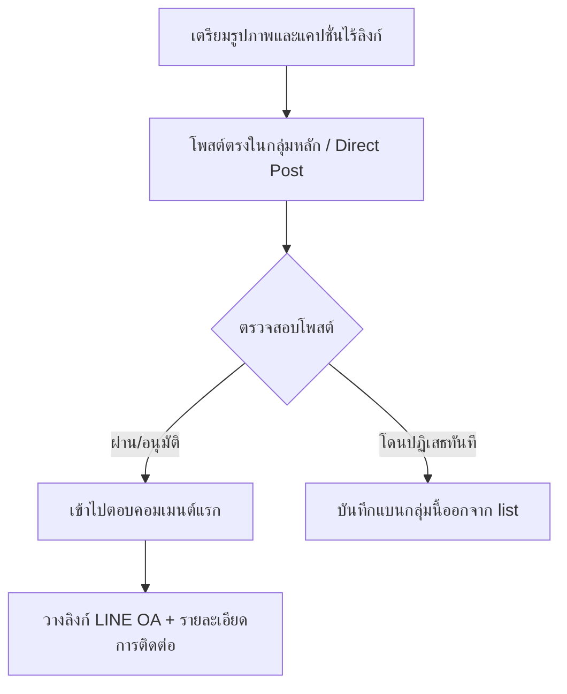

# คู่มือการโพสต์กลุ่ม Facebook ปลอดภัย เลี่ยงโดนลบ & โดนแบน (บอทป้าเข็ม)

คู่มือฉบับนี้จัดทำขึ้นสำหรับเจ้าของระบบและแอดมิน **บอทป้าเข็ม** เพื่อใช้เป็นแนวทางปฏิบัติและกำหนดกลยุทธ์การโพสต์/แชร์ข้อมูลลงในกลุ่ม Facebook ต่างๆ เพื่อแก้ปัญหาระบบคัดกรองอัตโนมัติ (Admin Assist) หรือ AI ของ Facebook ลบโพสต์โดยอัตโนมัติ

## 🧠 0. เจาะลึกอัลกอริทึม Facebook 2026 & กลยุทธ์ที่ต้องรู้

อัลกอริทึมของ Facebook ในปี 2026 มีการเปลี่ยนแปลงโครงสร้างหลักที่ส่งผลกระทบต่อการเข้าถึง (Reach) ดังนี้:

* **AI Discovery Engine (การค้นพบด้วย AI):** Facebook เปลี่ยนผ่านจากการเน้นแสดงเนื้อหาตามความสัมพันธ์ของเพื่อน (Friend-based feed) ไปเป็นระบบจับคู่ตามความสนใจแบบ 100% ดังนั้น **การโพสต์ให้ตรงกลุ่มเป้าหมายที่มีความสนใจเฉพาะด้านเจาะจง** จะมีโอกาสที่ AI ของระบบจะช่วยดันโพสต์ให้คนในและนอกกลุ่มเห็นได้มหาศาล (Organic Reach สูงมาก)
* **กลุ่ม (Groups) & วิดีโอสั้น (Reels) คือช่องทางหลัก:** การเข้าถึงผ่านเพจธุรกิจทั่วไปถูกลดระดับลงอย่างมาก แต่ช่องทางกลุ่มและ Reels ยังเป็นที่ที่ได้รับการส่งเสริมอัลกอริทึมให้มีอัตราการเข้าถึงสูงที่สุด
* **เน้นปฏิสัมพันธ์ที่มีความหมาย (Meaningful Interaction):** การกดถูกใจ (Like) แบบผ่านๆ แทบไม่มีผลต่อคะแนนโพสต์แล้ว แต่อัลกอริทึม 2026 จะจัดลำดับความสำคัญให้โพสต์ที่มี **การคอมเมนต์ที่มีคุณภาพ (Quality Comments) และการกดแชร์ต่อผ่านข้อความส่วนตัว (DM/Messenger Share)** ดังนั้นแคปชั่นในโพสต์หลักควรเขียนเชิงตั้งคำถามหรือกระตุ้นให้มีคนเข้ามาตอบหรือพูดคุยแลกเปลี่ยน
* **ระบบโพสต์อัตโนมัติ (Auto-posting):** สามารถนำมาใช้เพื่อเพิ่มประสิทธิภาพในการกระจายข่าวสารได้ แต่ต้องทำภายใต้ระบบความปลอดภัยสูง (เช่น ป้องกันการยิงสแปมด้วยคีย์เวิร์ดเดิม, การจำกัดโควตา และการกระจายโพสต์แบบสุ่มเวลา) เพื่อไม่ให้ถูกลดความน่าเชื่อถือของบัญชี (Account Trust Score)

---

## 🚀 1. โฟลว์การโพสต์สไตล์ "ปลอดภัย" (Safe Posting Flow)

เทคนิคที่ได้ผลที่สุดในการเลี่ยงการสแกนลิงก์สแปมคือ **"โพสต์หลักสะอาด แล้วแปะลิงก์ในคอมเมนต์"**

### ขั้นตอนปฏิบัติ:
1. **โพสต์หลัก (Main Post):** โพสต์เฉพาะ **รูปภาพโปสเตอร์ (หรือรูปที่น่าสนใจ) + ข้อความชวนคุยแบบธรรมชาติ** โดย **"ห้ามมีลิงก์เชื่อมโยงภายนอกเด็ดขาด"** (ไม่มีลิงก์ไลน์, ไม่มีลิงก์เว็บ)
2. **คอมเมนต์แรก (First Comment):** หลังจากโพสต์เสร็จเรียบร้อย ให้เข้าไปเขียนคอมเมนต์ใต้โพสต์นั้นทันที เช่น:
   > *"สนใจติดตั้งระบบบอทช่วยขาย พิกัดแอดไลน์คุยกับป้าเข็มตรงนี้ได้เลยจ้า 👉 [ลิงก์ LINE OA]"*

---

## ✍️ 2. กฎการปรับแต่งแคปชั่น (Caption & Word Modification)

ตัวกรองอัตโนมัติ (Admin Assist) ของกลุ่มส่วนใหญ่จะสแกนคำคีย์เวิร์ดโฆษณาตรงๆ ดังนั้นควรหลีกเลี่ยงการใช้คำเดิมซ้ำๆ

### 🚫 คำที่ควรหลีกเลี่ยง VS ✅ คำที่ควรใช้แทน
| คำต้องห้าม (เสี่ยงโดนกรอง) | คำเลี่ยงแนะนำ | ตัวอย่างประโยค |
| :--- | :--- | :--- |
| **แอดไลน์, Add Line, Line** | ทักไลน์, คุยกับป้า, ช่องทางนี้ | *“ทักคุยรายละเอียดกับป้าเข็มได้ที่...”* |
| **ราคา xxx.-, เริ่มต้น xxx บาท** | ค่าขนมป้า, แพ็กเกจสบายกระเป๋า | *“คุยแพ็กเกจสบายกระเป๋าได้เลยจ้า”* |
| **สมัครเลย, คลิกลิงก์** | แวะมาคุยกัน, ปักหมุดไว้ที่... | *“รายละเอียดเพิ่มเติม ปักหมุดไว้ที่คอมเมนต์แรกจ้า”* |
| **ลิงก์ย่อ เช่น `lin.ee`** | ใช้โดเมนตัวเอง หรือบอกไอดีไลน์ | *“ทักไลน์ไอดี @xxxxx (มี @ ด้วยนะคะ)”* |

> [!TIP]
> **เทคนิค Spintax (การหมุนเวียนคำ):** พยายามสลับประโยคหรือสลับการใช้ Emoji ในสคริปต์ ไม่ใช้ประโยคเดิมเป๊ะๆ โพสต์ลงทุกกลุ่ม เพราะ Facebook จะจำค่า Hash ของข้อความและตีว่าเป็นสแปมระบบส่งข้อความซ้ำ

---

## ⏱️ 3. การควบคุมพฤติกรรมและความถี่ (Frequency & Delay Control)

ระบบสแปมฟิลเตอร์ของ Facebook จับตาดูความเร็วในการโพสต์เป็นหลัก

* **เว้นระยะห่าง (Post Delay):** หากแชร์หรือโพสต์ลงกลุ่ม ควรเว้นระยะห่าง **อย่างน้อย 15-30 นาทีต่อหนึ่งกลุ่ม** (ห้ามรันโพสต์ 10 กลุ่มใน 1 นาทีเด็ดขาด)
* **จำกัดโควตาต่อวัน (Daily Limits):** บัญชีเฟซบุ๊กธรรมดา 1 บัญชี ไม่ควรโพสต์หรือแชร์ลงกลุ่มเกิน **5-10 กลุ่มต่อวัน**
* **สลับบัญชีโพสต์:** หากมีกลุ่มเป้าหมายจำนวนมาก ควรแบ่งกลุ่มออกเป็นหลายๆ ไฟล์ แล้วใช้บัญชีเฟซบุ๊กต่างกันในการสลับกันโพสต์

---

## 🤝 4. การสร้างประวัติที่ดีให้บัญชี (Account Warm-up)

บัญชีที่เพิ่งเข้ากลุ่มแล้วโพสต์ขายของทันทีจะถูกมองเป็นบอทขยะ 100%

* **เมื่อเข้ากลุ่มใหม่:** ให้รอ 2-3 วันก่อนเริ่มโพสต์ครั้งแรก
* **สร้างปฏิสัมพันธ์:** ในช่วงวอร์มเครื่อง ให้เข้าไปกดไลก์ หรือคอมเมนต์โพสต์ที่เป็นประโยชน์ของสมาชิกคนอื่นในกลุ่มนั้นๆ เพื่อให้ระบบมองว่ามีตัวตนจริงและมีคุณภาพ
* **โพสต์มีคุณค่าก่อน:** โพสต์แรกๆ ในกลุ่ม ควรเป็นโพสต์ทักทาย ถามคำถาม หรือแชร์ความรู้โดยไม่ขายของเลย เพื่อสร้างเครดิตให้กับโปรไฟล์

---

## 🛠️ 5. การปรับใช้กับบอทป้าเข็ม

1. **คัดกรองรายชื่อกลุ่ม (`groups.txt`):** 
   * ทำการลบกลุ่มที่ระบบ Admin Assist สั่งลบโพสต์ของเราบ่อยๆ ออกไป และใส่กลุ่มที่มีปฏิสัมพันธ์ดีและอนุมัติโพสต์ง่ายเข้าไปแทน
2. **การรันบอทแคมเปญแบบระมัดระวัง:**
   * ใช้คำสั่ง `--dry-run` เพื่อทดสอบตรวจสอบหน้าตาของโพสต์และแคปชั่นก่อนจะยิงจริงเสมอเพื่อประเมินความสุ่มเสี่ยง

---

## 🛡️ 6. แผนการอุ่นบัญชี Facebook 30 วัน (30-Day Warming Roadmap)

การอุ่นบัญชี (Account Warming) เป็นขั้นตอนที่สำคัญที่สุดในการสร้างความน่าเชื่อถือให้กับอัลกอริทึม (Trust Score) เพื่อป้องกันการโดนจำกัด หรือระงับบัญชีโฆษณาก่อนใช้งานจริง โดยเฉพาะบัญชีใหม่หรือบัญชีที่ซื้อมา

### สัปดาห์ที่ 1: การจำลองพฤติกรรมและสร้างความน่าเชื่อถือของบุคคล
* **วันแรก ๆ (วันที่ 1 - 2): ล็อกอินและเฝ้าดูแบบเงียบ ๆ**
  * ล็อกอินค้างไว้บนอุปกรณ์และ IP ที่สะอาด (แนะนำ Antidetect Browser + Residential Proxy ประจำประเทศนั้น ๆ และใช้ Cookie แทนรหัสผ่าน)
  * **ข้อห้ามเด็ดขาด:** ห้ามเพิ่งเปลี่ยนรูปโปรไฟล์ ชื่อ หรือข้อมูลทันที
  * กิจกรรม: เลื่อนดูฟีดข่าว ไลก์ ชมวิดีโอ/Reels 15-30 นาที/วัน ห้ามโพสต์หรือยิงแอด
* **กลางสัปดาห์ (วันที่ 3 - 5): การสร้างตัวตน**
  * ทยอยกรอกโปรไฟล์ เช่น เพิ่มภาพโปรไฟล์ ข้อมูลการศึกษา เมืองที่อยู่ ข้อมูลติดต่อ
  * เพิ่มเพื่อนไม่เกินวันละ 2-3 คน (รับแอดหรือแอดเพื่อนจากรายชื่อแนะนำ)
  * เข้าร่วมกลุ่มเคลื่อนไหวทั่วไป 2-3 กลุ่ม
* **ปลายสัปดาห์ (วันที่ 6 - 7): การโต้ตอบออร์แกนิก**
  * โพสต์ข้อความ/ภาพชีวิตประจำวัน 1-2 โพสต์บนโปรไฟล์ส่วนตัว
  * ทักแชทสอบถามข้อมูลสินค้าเพจอื่น เพื่อแสดงพฤติกรรมลูกค้าจริง
  * เปิดการใช้งาน 2FA และตั้งรหัสอีเมลสำรอง

### สัปดาห์ที่ 2: การสร้างหน้าเพจธุรกิจ (Fan Page)
* **ช่วงวันที่ 8 - 14:**
  * เริ่มสร้าง Fan Page ใหม่ หรือผูกบัญชีกับเพจที่มีอยู่แล้ว
  * เคลื่อนไหวโพสต์คอนเทนต์รูปภาพ/วิดีโอที่มีประโยชน์แบบไม่โฆษณาขายตรง
  * มีปฏิสัมพันธ์พิมพ์คอมเมนต์จริงใต้โพสต์ของเพจแบรนด์อื่นๆ เพื่อให้ดูเหมือนผู้ใช้จริง

### สัปดาห์ที่ 3: การตั้งค่าระบบหลังบ้านและ Business Manager (BM)
* **ช่วงวันที่ 15 - 21:**
  * สร้างหรือเพิ่มบัญชีเข้าไปใน Business Manager (BM)
  * วางโครงสร้างเก็บพิกเซลโฆษณาในบัญชีหลัก (ที่ไม่ใช้ยิงแอดตรง) แล้วแชร์สิทธิ์มาให้บัญชีวอร์ม
  * โพสต์ข้อความที่ต้องการใช้โฆษณาลงเพจแบบออร์แกนิก (ไม่ใส่ลิงก์เว็บนอก) เพื่อทดสอบการกรองนโยบายของ AI

### สัปดาห์ที่ 4: การผูกบัตรชำระเงินและแคมเปญโฆษณาเริ่มต้น
* **ช่วงวันที่ 22 - 30:**
  * **การผูกบัตรชำระเงิน:** เชื่อมบัตรโฆษณาโดยใช้วิธีพิมพ์มือ ห้ามก๊อปปี้วาง และตรวจสอบรหัส ZIP ของบัตรให้ตรงกับ IP Proxy
  * **แคมเปญงบต่ำ (Soft Campaigns):** ยิงแคมเปญโฆษณาแรก (Reach/Page Likes/Video Views) งบวันละ $10–$30 (300-1000 บาท) เพื่อสร้างประวัติชำระเงิน
  * **ข้อควรระวัง:** ห้ามใส่ลิงก์เชื่อมโยงเว็บนอกหรือข้อเสนอพิเศษในโฆษณาแรกเด็ดขาด
  * ขยายงบไม่เกินวันละ 20-30% เมื่อระบบเริ่มทำงานราบรื่น

### ⚠️ 3 กฎเหล็ก "วอร์มบัญชีไม่ให้โดนแบน"
1. **รักษาความเสถียรของ IP (IP Stability):** ใช้ IP หรือพร็อกซีเดิมเสมอ แนะนำรันระบบบน VPS
2. **แยกสินทรัพย์เด็ดขาด (1 Account = 1 Identity):** แยกเบราว์เซอร์โปรไฟล์ พร็อกซี และบัตรชำระเงินไม่ให้ซ้ำกัน
3. **เลี่ยงพฤติกรรมสแปม (Anti-Spam Filter):** ห้ามแชร์ถี่ ห้ามแอดเพื่อนเยอะ หรือคอมเมนต์รัวๆ ในช่วงแรก

---

## 📝 7. เทมเพลตแคปชั่นโพสต์ลงเพจ (Page Caption Templates)

เพื่อความปลอดภัยสูงสุดและกระตุ้นการมองเห็นของ AI Discovery Engine 2026 แนะนำให้ใช้แคปชั่นแนว **"แบ่งปันคุณค่า / ชวนพูดคุย"** ลงหน้าเพจแทนการขายตรง:

### เทมเพลตที่ 1: แนวแชร์ไอเดียสร้างรายได้ (ชวนคุยสร้างปฏิสัมพันธ์)
> **[หัวข้อดึงดูด]:** ทำ Shopee Affiliate ปี 2026 ยังไงให้จับเงินหมื่นได้แบบไม่ต้องเหนื่อยทำมือทั้งวัน? 💰✨
>
> หลายคนบ่นว่ายอดตก คอนเทนต์โดนลดการมองเห็น... ความจริงคืออัลกอริทึมเปลี่ยนไปเน้นความสนใจรายบุคคลแล้วค่ะ! วันนี้ป้าเข็มอยากชวนทุกคนมาแชร์ไอเดียกัน:
> 
> 💡 ระหว่าง "โพสต์รูปรีวิวสไตล์แบ่งปันความรู้" กับ "แชร์ลิงก์ดิบๆ ลงกลุ่มตรงๆ" แบบไหนสร้างยอดให้เพื่อนๆ ได้ดีกว่ากันคะ? คอมเมนต์มาคุยกันใต้โพสต์นี้เลย! 
> 
> *(ป.ล. ใครขี้เกียจทำระบบหาของ-คัดลิงก์เอง ป้ามีตัวช่วยออโต้รันหลังบ้าน ปักหมุดรายละเอียดไว้ในคอมเมนต์แรกนะจ๊ะ 😉)*

### เทมเพลตที่ 2: แนวบอกเล่าการทำงานของระบบ (แบ่งปันความรู้)
> **[หัวข้อดึงดูด]:** 🛠️ รู้จักกับระบบหลังบ้าน "บอทป้าเข็ม" ทำไมถึงช่วยเซฟเวลาการทำ Affiliate ได้ถึง 90%?
>
> 1. ระบบช่วยเลือกสินค้าติดอันดับขายดีและลิงก์มีสถานะ OK (เช็คลิงก์เสียให้อัตโนมัติ)
> 2. สร้างแคปชั่นป้ายยาด้วย AI ให้สอดคล้องกับโทนและกลุ่มผู้ซื้อโดยตรง
> 3. ทำงานบนคีย์ส่วนตัวของคุณเอง ข้อมูลปลอดภัย ไม่ปนกับใคร
>
> เพื่อนๆ ที่ทำแอฟฟิลิเอตอยู่ ตอนนี้เจอปัญหาลิงก์ตายหรือโดนลบโพสต์บ่อยไหมคะ? แชร์ความเห็นกันหน่อยน้า 👇
>
> *(รายละเอียดช่องทางทักคุยกับป้าเข็ม ดูได้ที่คอมเมนต์แรกจ้า)*
