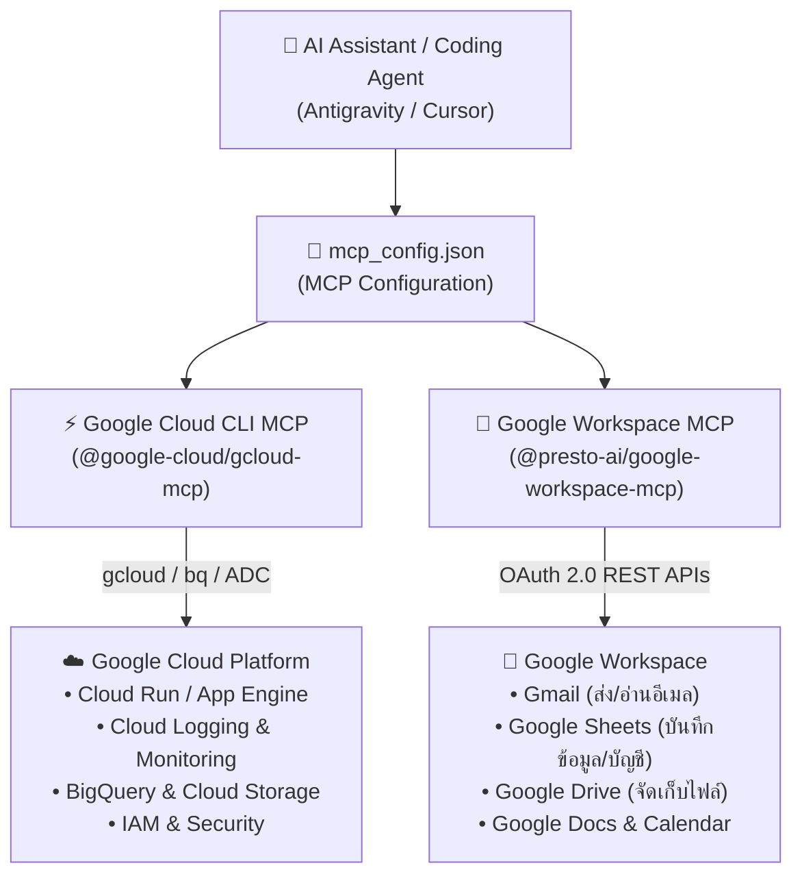

# คู่มือการติดตั้งและใช้งาน Google Cloud CLI MCP & Google Workspace MCP Servers
**ฉบับสมบูรณ์: สถาปัตยกรรม, การตั้งค่า, ความปลอดภัย และกรณีการใช้งานจริง**

---

## 1. ภาพรวมสถาปัตยกรรม (Architecture & Executive Summary)

**Model Context Protocol (MCP)** เป็นมาตรฐานเปิดที่ช่วยเชื่อมต่อโมเดล AI (เช่น Gemini, GPT, Groq AI) เข้ากับคลาวด์และเครื่องมือภายนอกได้อย่างไร้รอยต่อ โดยการเพิ่ม:
1. **Google Cloud CLI MCP Server (`@google-cloud/gcloud-mcp`)**: ให้ AI สื่อสารและควบคุมทรัพยากรบน **Google Cloud Platform (GCP)** ผ่านคำสั่งภาษาธรรมชาติ โดยไม่ต้องจำไวยากรณ์ `gcloud` หรือ `bq`
2. **Google Workspace MCP Server (`@presto-ai/google-workspace-mcp`)**: ให้ AI เชื่อมต่อกับ **Gmail, Google Drive, Google Sheets, Google Docs, และ Google Calendar** เพื่อทำงานธุรการและวิเคราะห์ข้อมูลแบบอัตโนมัติ 100%



---

## 2. 5 กรณีการใช้งานจริงและผลลัพธ์ทางธุรกิจ (5 Real-World Use Cases)

### 📌 1. การสืบค้นและแก้ไขปัญหาของระบบแบบไร้คอนโซล (Zero-Console Debugging)
* **ปัญหาเดิม**: วิศวกรต้องเปิดเบราว์เซอร์เข้า Google Cloud Console, ค้นหา Service ใน Cloud Run/GKE, เปิด Cloud Logging, ฟิลเตอร์หา Error แล้วสลับหน้าจอกลับมาแก้โค้ดใน IDE
* **โซลูชัน MCP**: สั่ง AI ในช่องแชทได้ทันที เช่น:
  > *"เช็คให้หน่อยว่าทำไม Cloud Run Service `shopee-backend` ถึงขึ้น 500 ในช่วง 15 นาทีที่ผ่านมา"*
* **ผลลัพธ์**: AI ดึง Log จาก Cloud Logging มาสรุป Stack Trace ค้นพบจุดผิดพลาดในโค้ด และเสนอจุดแก้ไขบน IDE ให้เสร็จในหน้าต่างเดียว ลดเวลาแก้ปัญหา (MTTR) จาก 30 นาทีเหลือไม่ถึง 2 นาที

---

### 📌 2. การกู้วิกฤตและควบคุมระบบแบบเรียลไทม์ (Incident Remediation & Operations)
* **ปัญหาเดิม**: ระบบรับโหลดสูงช่วง Flash Sale หรือ Live Stream ส่งผลให้เซิร์ฟเวอร์ตอบสนองช้า ต้องใช้คำสั่ง CLI ที่ยาวและเสี่ยงต่อการพิมพ์ผิด
* **โซลูชัน MCP**: สั่งงานผ่านภาษาธรรมชาติ เช่น:
  > *"ปรับ Max Instances ของ Cloud Run `shopee-backend` เพิ่มเป็น 20 instances ด่วน"*
  > *"Rollback Cloud Run service ไปยัง Revision สีเขียวก่อนหน้า"*
* **ผลลัพธ์**: AI สั่ง Execute ผ่าน `gcloud run services update` อย่างแม่นยำ พร้อมตรวจสอบสถานะความพร้อมให้ทันที

---

### 📌 3. การจัดการสิทธิ์และความปลอดภัย (IAM & Security Governance)
* **ปัญหาเดิม**: การตรวจสอบสิทธิ์ของ Service Accounts ในโปรเจกต์มักทำได้ยาก และมักเผลอให้สิทธิ์กว้างเกินไป (Over-permissioned)
* **โซลูชัน MCP**: ตรวจสอบและจัดการสิทธิ์แบบ Least Privilege เช่น:
  > *"ตรวจสอบสิทธิ์ของ Service Account `bot-runner@...` ว่ามี Role อะไรเกินความจำเป็นหรือไม่"*
  > *"สร้าง Service Account ใหม่สำหรับดึง BigQuery อย่างเดียว โดยให้สิทธิ์แค่อ่าน (Data Viewer)"*
* **ผลลัพธ์**: ความปลอดภัยของระบบเป็นไปตามมาตรฐาน Zero Trust Architecture

---

### 📌 4. การจัดการฐานข้อมูลและการวิเคราะห์ BigQuery (Data Warehouse & Analytics)
* **ปัญหาเดิม**: การเขียน SQL ซับซ้อนเพื่อรวมยอดขาย Shopee Affiliate หรือดึงข้อมูล Conversion ต้องใช้เวลาเขียนและจูนคิวรี่
* **โซลูชัน MCP**: สั่งผ่าน BigQuery Integration เช่น:
  > *"คิวรี่ตาราง `shopee_orders` ใน BigQuery สรุปยอดขายและค่าคอมมิชชั่นแยกตามหมวดหมู่ของสัปดาห์นี้"*
* **ผลลัพธ์**: AI ดึงข้อมูลผ่าน `bq query` แปลงผลลัพธ์เป็นตารางหรือกราฟให้เห็นในแชททันที

---

### 📌 5. การทำงานร่วมกับ Google Workspace แบบอัตโนมัติ (Drive, Sheets, Docs, Gmail)
* **การใช้งานร่วมกับระบบป้าเข็ม & Shopee Bot**:
  1. **Google Sheets**: ให้ AI อัปเดตรายชื่อสินค้าขายดี, สรุปยอดเงินโอนเข้าบัญชี, และบันทึกประวัติการโพสต์ Reels/Shorts/TikTok
  2. **Google Drive**: สั่งค้นหาและจัดระเบียบคลิปวิดีโอใน Drive สำรองไฟล์สำคัญ
  3. **Gmail**: ร่างและส่งอีเมลแจ้งเตือนใบแจ้งหนี้/สลิปโอนเงินให้กับลูกค้า SaaS แบบอัตโนมัติ
  4. **Google Calendar**: บันทึกกำหนดการโพสต์แคมเปญใหญ่ (9.9, 11.11, 12.12) และเตือนหมดอายุ Facebook Token

---

## 3. ขั้นตอนการติดตั้งและตั้งค่า Authentication (Step-by-Step Setup)

### ขั้นตอนที่ 1: ติดตั้ง Google Cloud SDK บนเครื่อง (หากยังไม่มี)
เปิด PowerShell และรันคำสั่งติดตั้งผ่าน `winget`:
```powershell
winget install Google.CloudSDK
```
*หรือดาวน์โหลดตัวติดตั้งทางการจาก: [https://cloud.google.com/sdk/docs/install](https://cloud.google.com/sdk/docs/install)*

### ขั้นตอนที่ 2: ล็อกอิน Google Cloud CLI
รันคำสั่งล็อกอินและตั้งค่า Application Default Credentials (ADC):
```powershell
# 1. ล็อกอินบัญชีหลัก
gcloud auth login

# 2. ตั้งค่า Default Credentials เพื่อให้ MCP Server เรียกใช้งานได้
gcloud auth application-default login

# 3. กำหนด Project ID เริ่มต้น
gcloud config set project <YOUR_GCP_PROJECT_ID>
```

### ขั้นตอนที่ 3: การตั้งค่า Google Workspace API (OAuth 2.0)
1. ไปที่ [Google Cloud Console](https://console.cloud.google.com/)
2. เปิดใช้งาน API ที่ต้องการใช้งาน:
   - **Google Sheets API**
   - **Google Drive API**
   - **Gmail API**
   - **Google Calendar API**
3. ไปที่เมนู **APIs & Services > OAuth consent screen**:
   - เลือก **External** (หรือ Internal สำหรับ Google Workspace องค์กร)
   - เพิ่มอีเมลของคุณในช่อง **Test users**
4. ไปที่เมนู **Credentials > Create Credentials > OAuth client ID**:
   - Application type: **Desktop app**
   - Name: `Workspace MCP Client`
   - ดาวน์โหลดไฟล์คีย์ JSON มาเก็บไว้ในเครื่องอย่างปลอดภัย (เช่น `~/.config/google-workspace/credentials.json`)

---

## 4. ไฟล์การตั้งค่า MCP Config สำหรับ AI Clients

### สำหรับ Antigravity / Gemini IDE:
ไฟล์คอนฟิกอยู่ที่: `C:\Users\Lenovo\.gemini\config\mcp_config.json`
```json
{
  "mcpServers": {
    "gcloud": {
      "command": "npx.cmd",
      "args": [
        "-y",
        "@google-cloud/gcloud-mcp"
      ]
    },
    "google-workspace": {
      "command": "npx.cmd",
      "args": [
        "-y",
        "@presto-ai/google-workspace-mcp"
      ]
    }
  }
}
```

### สำหรับ Claude Desktop (`%APPDATA%\Claude\claude_desktop_config.json`):
```json
{
  "mcpServers": {
    "gcloud": {
      "command": "npx",
      "args": ["-y", "@google-cloud/gcloud-mcp"]
    },
    "google-workspace": {
      "command": "npx",
      "args": ["-y", "@presto-ai/google-workspace-mcp"]
    }
  }
}
```

### สำหรับ Cursor (`.cursor/mcp.json`):
```json
{
  "mcpServers": {
    "gcloud": {
      "command": "npx",
      "args": ["-y", "@google-cloud/gcloud-mcp"]
    },
    "google-workspace": {
      "command": "npx",
      "args": ["-y", "@presto-ai/google-workspace-mcp"]
    }
  }
}
```

---

## 5. ตัวอย่างชุดคำสั่งภาษาธรรมชาติที่ใช้งานได้ทันที (Prompt Cheatsheet)

| งานที่ต้องการ | ตัวอย่าง Prompt ที่ใช้สั่ง AI |
| :--- | :--- |
| **ดูสถานะ Cloud Run** | *"ช่วยเช็คสถานะและ URL ของ Cloud Run ทุกตัวในโปรเจกต์นี้ให้หน่อย"* |
| **ดึง Error Logs ล่าสุด** | *"ดึง error logs ของ service `shopee-backend` ย้อนหลัง 1 ชั่วโมงมาวิเคราะห์หาสาเหตุ"* |
| **คิวรี่ข้อมูล BigQuery** | *"รันคิวรี่บน BigQuery เพื่อหายอดวิวและยอดคลิกสูงสุด 10 อันดับแรกของสัปดาห์นี้"* |
| **อ่าน/เขียน Google Sheets** | *"เปิดชีต `Shopee Affiliate Summary` แล้วเพิ่มแถวยอดขายวันนี้ลงในชีต"* |
| **ค้นหาไฟล์ใน Google Drive** | *"ค้นหาไฟล์คลิปวิดีโอชื่อ `clip_review_*.mp4` ใน Google Drive ที่แก้ไขล่าสุด"* |
| **ร่างอีเมลใน Gmail** | *"ร่างอีเมลขอบคุณลูกค้าที่สั่งซื้อแพ็กเกจ SaaS Starter พร้อมแนบคู่มือการใช้งาน"* |
| **ตรวจสอบสิทธิ์ IAM** | *"แสดงรายชื่อ Service Accounts ทั้งหมดและ Role ที่ผูกอยู่เพื่อตรวจสอบความปลอดภัย"* |

---

## 6. กฎความปลอดภัยและการกำกับดูแล (Security & Governance)

1. **ห้าม Commit Credential Keys เข้า Git**: ไฟล์ `credentials.json`, `token.json` หรือ Service Account Key ต้องอยู่ใน `.gitignore` เสมอ
2. **หลัก Least Privilege**: กำหนดสิทธิ์ให้ Service Account เฉพาะ Service ที่จำเป็นต้องใช้ ห้ามให้ `Owner` หรือ `Editor` โดยไม่จำเป็น
3. **Audit Log Trail**: ทุกคำสั่งที่ AI ดึงหรือสั่งแก้ไข จะถูกบันทึกไว้ใน Cloud Audit Logs ของ Google Cloud สามารถตรวจสอบย้อนหลังได้ 100%

---

## 7. การรักษาความปลอดภัยและการควบคุมสิทธิ์ผ่าน IAM (Zero Trust & Impersonation Architecture)

### 7.1 การตั้งค่า Service Account สำหรับ AI Agent (Least Privilege)
เพื่อหลีกเลี่ยงการใช้สิทธิ์ของ User ส่วนตัวในการรัน AI Agent ในระบบ Production ให้สร้าง Service Account แยกเฉพาะ:

```bash
# 1. กำหนดตัวแปรโปรเจกต์และชื่อ Service Account
export PROJECT_ID="your-gcp-project-id"
export SA_NAME="mcp-agent-sa"
export SA_EMAIL="${SA_NAME}@${PROJECT_ID}.iam.gserviceaccount.com"
export USER_EMAIL="developer@example.com"

# 2. สร้าง Service Account สำหรับ AI Agent
gcloud iam service-accounts create ${SA_NAME} \
    --project="${PROJECT_ID}" \
    --description="Service Account for MCP AI Agent with Least Privilege" \
    --display-name="MCP Agent Service Account"

# 3. กำหนดสิทธิ์เฉพาะเท่าที่จำเป็น (Least Privilege Roles)
# 3.1 สิทธิ์อ่าน Logs
gcloud projects add-iam-policy-binding ${PROJECT_ID} \
    --member="serviceAccount:${SA_EMAIL}" \
    --role="roles/logging.viewer"

# 3.2 สิทธิ์ตรวจสอบเมตริก Cloud Monitoring
gcloud projects add-iam-policy-binding ${PROJECT_ID} \
    --member="serviceAccount:${SA_EMAIL}" \
    --role="roles/monitoring.viewer"

# 3.3 สิทธิ์เรียกใช้ Cloud Run MCP Server ระยะไกล (ถ้ามี)
gcloud projects add-iam-policy-binding ${PROJECT_ID} \
    --member="serviceAccount:${SA_EMAIL}" \
    --role="roles/run.invoker"

# 3.4 สิทธิ์เรียกใช้เครื่องมือ MCP Tool (สเปกทางการ)
gcloud projects add-iam-policy-binding ${PROJECT_ID} \
    --member="serviceAccount:${SA_EMAIL}" \
    --role="roles/mcp.toolUser"
```

---

### 7.2 การเปิดสิทธิ์สวมบทบาท (Service Account Impersonation)
แทนที่จะสร้างไฟล์คีย์ JSON ถาวร (`service-account-key.json`) ซึ่งเสี่ยงต่อการหลุดรั่ว ให้ใช้ระบบ **Impersonation**:

```bash
# มอบสิทธิ์ให้ User สามารถสวมบทบาท Service Account นี้ได้
gcloud iam service-accounts add-iam-policy-binding ${SA_EMAIL} \
    --project="${PROJECT_ID}" \
    --member="user:${USER_EMAIL}" \
    --role="roles/iam.serviceAccountTokenCreator"
```

---

### 7.3 ตัวอย่างไฟล์ `mcp_config.json` แบบ Impersonate ปลอดภัย 100%

การตั้งค่าใน `mcp_config.json` สามารถกำหนดค่า Environment Variable `CLOUDSDK_AUTH_IMPERSONATE_SERVICE_ACCOUNT` เพื่อบังคับให้เซิร์ฟเวอร์ MCP สวมบทบาท Service Account ทุกครั้งที่เรียกใช้งาน:

```json
{
  "mcpServers": {
    "gcloud": {
      "command": "npx.cmd",
      "args": [
        "-y",
        "@google-cloud/gcloud-mcp"
      ],
      "env": {
        "CLOUDSDK_CORE_PROJECT": "your-gcp-project-id",
        "CLOUDSDK_AUTH_IMPERSONATE_SERVICE_ACCOUNT": "mcp-agent-sa@your-gcp-project-id.iam.gserviceaccount.com"
      }
    },
    "google-workspace": {
      "command": "npx.cmd",
      "args": [
        "-y",
        "@presto-ai/google-workspace-mcp"
      ],
      "env": {
        "GOOGLE_WORKSPACE_CREDENTIALS_PATH": "C:\\Users\\Lenovo\\.config\\google-workspace\\credentials.json",
        "GOOGLE_WORKSPACE_TOKEN_PATH": "C:\\Users\\Lenovo\\.config\\google-workspace\\token.json"
      }
    }
  }
}
```

---

### 7.4 กลไกการป้องกันความเสี่ยงขั้นสูง (Enterprise Zero Trust)

1. **Centralized MCP Proxy**: ติดตั้ง MCP Proxy บน Cloud Run หรือ GKE ทำหน้าที่เป็น Gateway ดักจับทุกคำขอ คัดกรอง Per-client Consent และยืนยันตัวตนผ่าน SPIFFE / mTLS ก่อนส่งต่อไปยัง Backend API
2. **Model Armor Integration**: ตรวจสอบทั้งคำสั่ง Prompt ขาเข้า และผลลัพธ์จาก Model ขาออกเพื่อป้องกัน Prompt Injection, Jailbreak และกรอง Sensitive Data (PII, บัตรเครดิต, รหัสผ่าน) อัตโนมัติ
3. **Cloud Audit Logs & SCC**: บันทึกกิจกรรมของ Principal ที่สวมบทบาท (Caller Identity + Impersonated Principal) ลงใน Cloud Audit Logs และส่ง Alert เข้า Security Command Center เมื่อมีพฤติกรรมผิดปกติทันที

---

## 8. โครงสร้างบัญชีหลายอีเมลและการแยกบทบาทความปลอดภัย (Multi-Email Master Matrix & Air-Gapped Isolation)

เพื่อความปลอดภัยสูงสุดในการปฏิบัติการจริง ระบบถูกออกแบบให้แยกหน้าที่ของแต่ละบัญชีอีเมลอย่างเด็ดขาดตามหลัก **Separation of Duties (SoD)** และ **Least Privilege**:

| บัญชีอีเมล | บทบาทหน้าที่หลัก (Primary Role) | ขอบเขตการเข้าถึง (Access Scope) | สถานะความปลอดภัย (Security Guard) |
| :--- | :--- | :--- | :--- |
| **`regency2919@gmail.com`** | 🛠️ **Primary Dev & GCP Architecture** | บัญชีผู้ดูแล Google Cloud หลัก, Gemini AI, gcloud CLI, Service Account Impersonation | สวมบทบาทผ่าน `mcp-agent-sa` แบบ Least Privilege (ไม่ใช้ Long-Lived Key) |
| **`regency1229@gmail.com`** | 📈 **Personal Investment & Trading** | บัญชีเทรดหุ้น พอร์ตลงทุนส่วนตัว (`openclaw-trading`) | **Air-Gapped 100%**: ปลดออกจาก Git Config, ป้องกันไม่ให้มีรหัสหรือโทเคนใดๆ ในระบบบอท |
| **`g81393878@gmail.com`** (`g81393878-bit`) | 🏢 **System Owner & Production Infrastructure** | เจ้าของ GitHub Repository, Supabase Database Production, Render Backend Service | ป้องกันด้วย 2FA และใช้ Deploy Token แยกรายเซอร์วิส |
| **Channel YouTube Tokens** | 📺 **6-Channel Broadcast Engine** | ช่อง YouTube Shorts ทั้ง 6 ช่อง (`youtube_token.json` ถึง `youtube_token_6.json`) | เก็บโทเคน OAuth แยกรายช่อง หมุนเวียน Round-Robin ทุก 30 นาที |

### 8.1 การตรวจสอบความพร้อมของระบบ Impersonation บนโปรเจกต์จริง
- **GCP Project ID**: `gen-lang-client-0232202005` (เป็นของ `regency2919@gmail.com`)
- **Service Account**: `mcp-agent-sa@gen-lang-client-0232202005.iam.gserviceaccount.com`
- **Service Account Token Creator**: ผูกสิทธิ์ให้ `user:regency2919@gmail.com`
- **Roles บนโปรเจกต์**: `roles/logging.viewer`, `roles/monitoring.viewer`
- **API ที่เปิดใช้งาน**: `iamcredentials.googleapis.com` (IAM Service Account Credentials API)
- **คำสั่งทดสอบสร้าง Bearer Token แบบ Impersonate**:
  ```powershell
  gcloud auth print-access-token --impersonate-service-account=mcp-agent-sa@gen-lang-client-0232202005.iam.gserviceaccount.com
  ```
  *(ผลการทดสอบ: คืนค่า Short-Lived Access Token สำเร็จ 100% โดยไม่ต้องบันทึก Private Key ลงในเครื่อง)*

