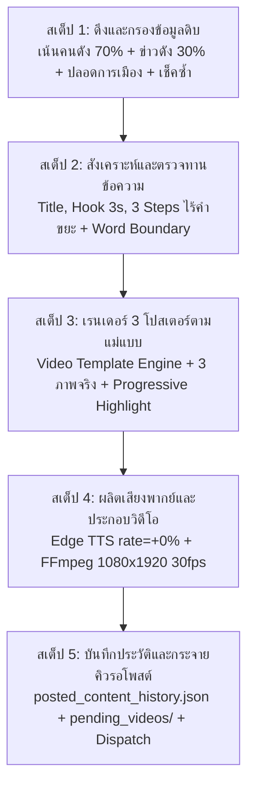

# คู่มือมาตรฐานบทที่ 10: แม่แบบวิดีโอระดับสตูดิโอ (Golden Master Template) และขั้นตอนการทำงานของบอท (Bot Production Pipeline SOP)

> **ปรัชญาหัวใจหลักของระบบ**: *"กำหนดไว้ และทำตามอย่างเดียว"* (Zero Improvisation, Zero Guesswork, Zero Layout Drift)  
> บอทและเอเจนต์ AI ทุกตัวต้องปฏิบัติตามข้อกำหนดพิกัด ขนาด โควต้าตัวอักษร และขั้นตอนการผลิต 5 สเต็ปนี้อย่างเคร่งครัด 100% ห้ามปรับเปลี่ยนเลย์เอาต์ ห้ามสลับข้อความขยะ และห้ามคิดเองเด็ดขาด

---

## 1. สเปกแม่แบบมาตรฐาน 5 Visual Zones (Canvas 1080x1920 9:16 Full HD)

```
+-------------------------------------------------------------+ (Y = 0)
|                       SAFE MARGIN TOP                       |
|  [                     [ หมวดหมู่ ]                      ]  | Y = 80..126  (Zone 1: Category Badge Pill)
|                                                             |
|           พาดหัว Hook 3 วินาทีหยุดนิ้ว (คงที่ตลอดคลิป)         | Y = 140..310 (Zone 2: Viral Hook Headline)
|                 (Phase 1: สีเหลือง / Phase 2-3: สีขาว)          |
|                                                             |
|  +-------------------------------------------------------+  | Y = 330..990 (Zone 3: Hero Media Frame 960x660)
|  |                                                       |  |   - ภาพถ่ายจริงตรงปก 100% ขอบมน 24px
|  |                 HERO PHOTO / MEDIA FRAME              |  |   - หรือ Hero Typography Card (ถ้าไม่มีภาพ)
|  |                                                       |  |
|  +-------------------------------------------------------+  |
|                                                             |
|  +-------------------------------------------------------+  | Y = 1015..1635 (Zone 4: Infographic 3 Steps 960x620)
|  |  • สาระสำคัญของเรื่องที่ต้องรู้                         |  |   (Container ขอบมน 26px)
|  |  +-------------------------------------------------+  |  |
|  |  | (1)  ข้อเท็จจริงที่ 1 / เหตุการณ์หลัก                 |  |  |   Row 1: Y=1083..1219 (888x136, r=18)
|  |  +-------------------------------------------------+  |  |
|  |  | (2)  ข้อเท็จจริงที่ 2 / รายละเอียดสำคัญ                |  |  |   Row 2: Y=1235..1371 (888x136, r=18)
|  |  +-------------------------------------------------+  |  |
|  |  | (3)  ข้อเท็จจริงที่ 3 / บทสรุปและผลกระทบ (เนื้อหาจริง) |  |  |   Row 3: Y=1387..1523 (888x136, r=18)
|  |  +-------------------------------------------------+  |  |
|  +-------------------------------------------------------+  |
|                                                             |
|  [     • กดติดตามช่อง Anda • ทัก LINE: @137gsref •      ]  | Y = 1680..1775 (Zone 5: Safe Action Bar Footer)
|                       SAFE MARGIN BOTTOM                    |
+-------------------------------------------------------------+ (Y = 1920)
```

### รายละเอียดพิกัดและขนาดของแต่ละโซน (Master Zone Specifications)

| โซน | พิกัดแนวตั้ง (Y) | ขนาด (WxH) | ฟอนต์และขนาด | สีข้อความ & ขอบ | กฎเหล็กประจำโซน |
| :--- | :--- | :--- | :--- | :--- | :--- |
| **Zone 1: ป้ายหมวดหมู่** | `Y = 80..126` | `440 x 46` px | Leelawadee Bold 23px | ตัวหนังสือขาว, ขอบขาว 2px, แคปซูลมน r=23 | แสดงชื่อหมวด เช่น `[ สรุปข่าวด่วนวันนี้ ]` ไม่เกิน 26 ตัวอักษร |
| **Zone 2: พาดหัว Hook** | `Y = 140..310` | กลางจอ (max 22 ตัว/บรรทัด) | Bold 48px (1-2 บรรทัด) / 38px (3 บรรทัด) | **Phase 1: สีเหลือง `#FFEB3B`**<br>**Phase 2 & 3: สีขาว `#FFFFFF`**<br>เงาดำ 4 ทิศทางหนา 3-4px | **ต้องเป็นหัวข้อเรื่องเดียวกันตลอดทั้ง 3 เฟส**<br>❌ **ห้ามเปลี่ยนเป็นคำเชิญชวน 'กดติดตาม' หรือ CTA เด็ดขาด** |
| **Zone 3: กรอบภาพ Hero** | `Y = 330..990` | `960 x 660` px | - | ขอบขาวโปร่งแสงหนา 3px, ขอบมน r=24px | ภาพถ่ายจริง Center-Crop 100%<br>หากไม่มีภาพ ให้สลับใช้ **Hero Typography Card** (Rule 26) ห้ามปล่อยกล่องดำ |
| **Zone 4: กล่อง 3 สาระสำคัญ** | `Y = 1015..1635` | `960 x 620` px (3 แถว แถวละ `888x136`) | หัวข้อ 26px, เลข 32px, ข้อความ 34-36px | แถว Active: สีประจำหมวดสว่าง<br>แถว Inactive: สีเทา Slate มืด | ไฮไลท์ทีละข้อแบบ Progressive (0-3s ข้อ 1, 3-6s ข้อ 2, 6-9s ข้อ 3)<br>❌ **ห้ามใส่ข้อความขยะ 'ติดตามช่อง', 'รอเนื้อหาใหม่' เด็ดขาด** |
| **Zone 5: แถบกระตุ้นท้ายคลิป** | `Y = 1680..1775` | `960 x 95` px (X=60..1020) | Bold 28px | พื้นดำ Slate `#0F172A`, ขอบเขียว `#22C55E`, ข้อความเขียว `#4ADE80` | ข้อความกระตุ้น: `• กดติดตามช่อง Anda • ทัก LINE: @137gsref •`<br>ปลอดภัยจากปุ่มขวาและแถบชื่อบัญชีล่าง 100% |

---

## 2. กฎเหล็กของข้อความและเสียงพากย์ (Content & Audio Rules)

1. **กฎพาดหัวด้านบน (Zone 2 Top Headline Consistency)**:
   - พาดหัวด้านบนต้องเป็น **หัวข้อ/Hook ของเนื้อหานั้นตลอดทั้ง 3 เฟส** เพื่อให้คนดูที่เลื่อนฟีดมาเจอวินาทีไหนก็รู้ทันทีว่ากำลังดูเรื่องอะไร
   - เฟส 1 (0-3s): สีเหลืองสดสะดุดตาหยุดนิ้ว
   - เฟส 2 และ 3 (3-9s): สีขาวคมชัด อ่านง่าย สบายตา
   - **ห้าม** นำข้อความ `phase3_text` หรือคำว่า "กดติดตาม" มาแทนที่พาดหัวด้านบนเด็ดขาด
2. **กฎสาระสำคัญ 3 ข้อ (Zero-Filler Policy in Step Rows)**:
   - หมวดข่าว (`TRENDING_NEWS`, `CELEBRITY_TREND`):
     - ข้อ 1: เกิดเหตุการณ์อะไรขึ้น (เหตุการณ์หลัก ประโยคสมบูรณ์)
     - ข้อ 2: รายละเอียดสำคัญ / ใครทำอะไร ที่ไหน อย่างไร
     - ข้อ 3: บทสรุป ผลกระทบ หรือสถานการณ์ล่าสุด (เนื้อหาข่าวจริง 100%)
   - **คำต้องห้ามเด็ดขาดในแถบสาระสำคัญ**: `"ติดตามช่อง"`, `"รอเนื้อหาใหม่"`, `"กดติดตาม"`, `"อย่าลืมกด"`, `"คำมั่นสัญญาต่อไป"` ห้ามหลุดเข้ามาเด็ดขาด หากพบให้กรองออกและใส่สาระสำคัญจริงทันที
3. **การตัดคำภาษาไทย (PyThaiNLP Tokenization & Tolerance)**:
   - ทุกข้อความต้องผ่าน `safe_thai_truncate()` หรือ `format_master_step()`
   - มีระยะผ่อนปรน (Tolerance) `+4 ตัวอักษร` เสมอ เพื่อป้องกันการตัดชื่อคนเฉพาะ (เช่น เร แม๊คโดแนลด์) หรือชื่อสถานที่ (เช่น นครปฐม) ขาด
   - ห้ามลงท้ายด้วยคำค้างคา หรือตัวเลขลอยๆ เช่น `" 2"` ให้เขียนให้จบใจความ เช่น `"ซีซั่น 2"`
4. **เสียงพากย์ AI TTS มาตรฐานเดียว 100%**:
   - Microsoft Edge Neural TTS (`th-TH-PremwadeeNeural`)
   - ล็อกความเร็ว `rate="+0%"` (Studio Normal Pacing ห้ามเร่งสปีดคลื่นเสียงเด็ดขาด)
   - หางเสียงเงียบ `+0.4s` ตอนจบประโยค เพื่อป้องกันการถูกตัดท้ายคำ
   - ลงท้ายประโยคด้วย "นะคะ" หรือ "นะจ๊ะ" ห้ามใช้ "ครับ"
5. **กฎ Zero Unicode Emoji บน Pillow Canvas**:
   - ห้ามใส่รูปภาพอิโมจิสีใน Pillow เด็ดขาด ให้ใช้สัญลักษณ์ `•` แทน ป้องกันตัวอักษรเต้าหู้ `[]`

---

## 3. ขั้นตอนการผลิต 5 สเต็ปสำหรับบอท (Bot 5-Step Pipeline SOP)

เมื่อระบบ Watchdog หรือคำสั่งผลิตคลิปทำงาน บอทต้องปฏิบัติตาม 5 สเต็ปนี้ตามลำดับอย่างเคร่งครัด:



### สเต็ปที่ 1: ดึงและคัดกรองข้อมูล (Data Ingestion & Safety Gate)
1. ดึงข้อมูลจาก RSS ข่าวดารา/คนดัง 70% (`CELEBRITY_TREND`: Sanook/Khaosod บันเทิง) และสรุปข่าวด่วน 30% (`TRENDING_NEWS`: ประเด็นร้อนสังคม) ปิดหมวดทริคชีวิต (0%)
2. ตรวจสอบเกราะความปลอดภัย (Content Safety Filter): ปลอดการเมือง, ไม่แตะสถาบันฯ, ไม่แตะ 112, ปลอดการพนัน/หวย
3. ตรวจสอบความซ้ำซ้อน 3 ชั้น (`is_topic_duplicate`): Exact Match, Substring 18 ตัวอักษร, และ PyThaiNLP Keyword Overlap ห้ามผลิตเรื่องซ้ำเด็ดขาด

### สเต็ปที่ 2: สังเคราะห์และตรวจทานข้อความ (Strict Content Synthesis)
1. สั่ง AI (Groq Multi-Key) หรือ Fallback Scorer ให้สร้าง:
   - `title`: หัวข้อหลัก กระชับ 25-42 ตัวอักษร
   - `hook_3s`: พาดหัวเปิดตัว 3 วิ หยุดนิ้ว 25-42 ตัวอักษร
   - `step1, step2, step3`: 3 สาระสำคัญ ประโยคสมบูรณ์ในตัว ข้อละ 20-38 ตัวอักษร
2. ผ่านฟังก์ชัน `format_master_hook()` และ `format_master_step()` ตรวจสอบว่าไม่มีคำเชื่อมหรือชื่อคนขาด
3. ตรวจจับและล้างคำขยะ Filler (ห้ามมี "ติดตามช่อง" หรือ "รอเนื้อหาใหม่" ใน steps 100%)

### สเต็ปที่ 3: เรนเดอร์ภาพโปสเตอร์ 3 จังหวะ (Master Canvas Rendering)
1. เรียก `video_template_engine.render_cinematic_template_posters()`:
   - ขนาด `1080x1920` (9:16)
   - ล็อกพาดหัวด้านบน Zone 2 เป็น `hook or title` เดียวกันตลอด 3 เฟส
   - ดึงภาพถ่ายจริง 3 ภาพจากข่าว (หรือสร้าง `create_typography_hero_card()` ถ้าไม่มีภาพ)
   - เรนเดอร์ 3 แถวใน Zone 4:
     - เฟส 1: ข้อ 1 สว่าง (Active), ข้อ 2-3 หรี่ (Inactive)
     - เฟส 2: ข้อ 2 สว่าง (Active), ข้อ 1, 3 หรี่ (Inactive)
     - เฟส 3: ข้อ 3 สว่าง (Active), ข้อ 1-2 หรี่ (Inactive)
   - วาดแถบ Zone 5 ท้ายคลิปปลอดภัย

### สเต็ปที่ 4: ผลิตเสียงพากย์และประกอบวิดีโอ (Audio & Video Assembly)
1. สร้างเสียงพากย์ด้วย Edge Neural TTS (`th-TH-PremwadeeNeural`, `rate="+0%"`)
2. ตรวจสอบไฟล์เสียงด้วย `verify_audio_file()` ต้องไม่ว่างเปล่าและมีความยาวสมบูรณ์
3. ประกอบภาพและเสียงด้วย FFmpeg:
   - วิดีโอสัดส่วน 9:16 (1080x1920) 30fps
   - เข้ารหัสวิดีโอ `libx264` (yuv420p, bitrate ~2500 kb/s)
   - เข้ารหัสเสียง `aac` (44.1kHz, 160 kb/s)
   - เวลาการแสดงผลของแต่ละเฟส = `ความยาวเสียงรวม / 3` เท่ากันเป๊ะ

### สเต็ปที่ 5: บันทึกประวัติและส่งเข้าคิวรอโพสต์ (Metadata & Queue Dispatch)
1. บันทึกหัวข้อลง `tools/posted_content_history.json` ทันทีเพื่อป้องกันการผลิตซ้ำ
2. บันทึก metadata ลง `reels_uploader/products.json`
3. บันทึกไฟล์ `.mp4` ลง `reels_uploader/pending_videos/`
4. เธรด Uploader ดึงไปกระจาย 13 ช่องทาง (Facebook 3 เพจ + YouTube Shorts 6 ช่อง + TikTok 4 ช่อง)

---

## 4. คำสั่งเครื่องมือสำหรับบอทและผู้ดูแลระบบ (CLI Toolkit)

| คำสั่ง | วัตถุประสงค์ |
| :--- | :--- |
| `python tools/master_reel_creator.py --auto --mode TRENDING_NEWS` | สั่งบอทผลิตคลิปข่าวสด 1 คลิปตามแม่แบบมาตรฐาน 100% |
| `python tools/master_reel_creator.py --auto --mode LIFE_HACK_TIP` | สั่งบอทผลิตคลิปทริคชีวิต 1 คลิปตามแม่แบบมาตรฐาน 100% |
| `python tools/master_reel_creator.py --custom --title "..." --hook "..." --steps "ข้อ1,ข้อ2,ข้อ3" -o output.mp4` | สร้างคลิปแบบระบุข้อความเอง 100% ตามแม่แบบ |
| `python tools/master_reel_creator.py --preview` | เรนเดอร์การ์ดตรวจสอบพิกัด ฟอนต์ และระยะห่าง (บันทึกภาพตัวอย่าง) |
| `pytest backend/tests/test_master_template.py -v` | รันชุดทดสอบตรวจสอบความถูกต้องของแม่แบบมาตรฐาน (12/12 ผ่าน 100%) |
