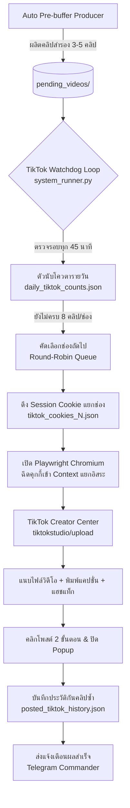

# 📱 กรณีศึกษาเชิงลึก (Case Study): ระบบ Multi-Account TikTok Studio Automation 24/7
## การบริหารจัดการ 4 ช่องหมุนเวียน 32 คลิป/วัน (เว้นระยะ 3 ชม./คลิป อัลกอริทึมธรรมชาติ 100%)

---

## 📑 สารบัญ (Table of Contents)
1. [บทนำและที่มาของระบบ (Background & Objective)](#1-บทนำและที่มาของระบบ)
2. [สถาปัตยกรรมทางวิศวกรรม (System Architecture)](#2-สถาปัตยกรรมทางวิศวกรรม)
3. [คู่มือการเพิ่มช่องใหม่ทีละสเต็ป (How to Add Channels)](#3-คู่มือการเพิ่มช่องใหม่ทีละสเต็ป)
   - [วิธีที่ 1: การล็อกอินด้วย QR Code ผ่านเบราว์เซอร์อัตโนมัติ](#วิธีที่-1-การล็อกอินด้วย-qr-code-ผ่านเบราว์เซอร์อัตโนมัติ)
   - [วิธีที่ 2: การดึงคุกกี้ดิบจาก Network Headers (Cookie Injection)](#วิธีที่-2-การดึงคุกกี้ดิบจาก-network-headers-cookie-injection)
4. [กลไกการโพสต์วิดีโออัตโนมัติ (Automated Posting Engine)](#4-กลไกการโพสต์วิดีโออัตโนมัติ)
5. [สูตรการคำนวณเวลาและผสมคอนเทนต์ (Timing & Content Mix Recipe)](#5-สูตรการคำนวณเวลาและผสมคอนเทนต์)
6. [ปัญหาจริงที่พบหน้างานและการแก้ปัญหา (Real-World Pitfalls & Fixes)](#6-ปัญหาจริงที่พบหน้างานและการแก้ปัญหา)
7. [การตรวจสอบและรายงานผลผ่าน Telegram Commander](#7-การตรวจสอบและรายงานผลผ่าน-telegram-commander)

---

## 1. บทนำและที่มาของระบบ

### 🎯 เป้าหมายทางธุรกิจ
เพื่อขยายฐานคนดู (Audience Reach) ให้ครอบคลุมทุกกลุ่มเป้าหมายบน TikTok จากเดิมที่มีเพียง **1 ช่องหลัก** สู่การบริหาร **4 บัญชีคู่ขนาน**:
1. **ช่อง 1: Anda Review (`@healthgooddeals`)** — รีวิวสินค้าของใช้ในบ้าน / สุขภาพ
2. **ช่อง 2: ชี้เป้าโปรคุ้ม (`@cheepao.review`)** — โปรโมชั่นและดีลเด็ด
3. **ช่อง 3: ป้าเข็ม รีวิว (`@pakhem.review99`)** — คอนเทนต์ไวรัล ข่าวเด่น และทริคชีวิต
4. **ช่อง 4: `@khonyangmefan`** — คอนเทนต์กระแสและวาไรตี้

### ⚠️ ความท้าทายทางเทคนิค
* **ข้อจำกัดของ TikTok Official API**: การขอ Content Posting API มีขั้นตอนซับซ้อน ใช้เวลาพิจารณาหลายสัปดาห์ และจำกัดโควตา
* **ระบบตรวจจับบอท (Akamai Bot Manager & WAF)**: TikTok มีระบบตรวจจับ Automation ที่เข้มงวด หากโพสต์ถี่เกินไปหรือใช้เบราว์เซอร์ที่มีร่องรอยบอท จะถูกบล็อกหรือแบนเงียบ (Shadowban)
* **ปัญหาเซสชันชนกัน (Session Bleeding)**: เมื่อเปิดหลายบัญชีบนเครื่องเดียวกัน คุกกี้มักจะตีกัน ทำให้คลิปไปลงผิดช่อง

---

## 2. สถาปัตยกรรมทางวิศวกรรม

ระบบถูกออกแบบด้วยสถาปัตยกรรม **Stateless Multi-Context Browser Engine** โดยใช้ **Playwright Python**:



### 🔑 องค์ประกอบสำคัญของระบบ
1. **ไฟล์คุกกี้แยกรายบัญชี**:
   - `tools/tiktok_cookies.json` (ช่อง 1)
   - `tools/tiktok_cookies_2.json` (ช่อง 2)
   - `tools/tiktok_cookies_3.json` (ช่อง 3)
   - `tools/tiktok_cookies_4.json` (ช่อง 4)
2. **ระบบความปลอดภัยข้อมูลลับ**: กำหนดให้ `tiktok_cookies*.json` อยู่ใน `.gitignore` เสมอ ห้ามดันขึ้น Git เด็ดขาด
3. **ระบบประวัติคลิปแยกรายช่อง (`posted_tiktok_history.json`)**: ป้องกันไม่ให้คลิปเดียวกันถูกนำไปโพสต์ซ้ำในช่องเดิม

---

## 3. คู่มือการเพิ่มช่องใหม่ทีละสเต็ป (How to Add Channels)

การเพิ่มช่อง TikTok ใหม่เข้าสู่ระบบทำได้ 2 วิธี:

### วิธีที่ 1: การล็อกอินด้วย QR Code ผ่านเบราว์เซอร์อัตโนมัติ (แนะนำสำหรับผู้ใช้ทั่วไป)
วิธีนี้ง่ายที่สุด เพราะระบบจะเปิดเบราว์เซอร์และจับคุกกี้ให้โดยอัตโนมัติ

```text
[ขั้นตอน]
1. ดับเบิ้ลคลิก START.bat บนเครื่องคอมพิวเตอร์
2. เลือกเมนู [5] ⚫ จัดการบัญชี TikTok Studio
3. เลือกเมนู [2] เพิ่ม / เข้าสู่ระบบ TikTok ช่องใหม่
4. พิมพ์หมายเลขช่อง เช่น 4 แล้วกด Enter
5. หน้าต่างเบราว์เซอร์ Chrome จะเปิดขึ้นมาที่หน้า Login ของ TikTok
6. เปิดแอป TikTok บนมือถือ ➔ ไปที่โปรไฟล์ ➔ กดเมนูขวาบน ➔ เลือก "สแกน QR Code"
7. สแกน QR Code บนหน้าจอคอมพิวเตอร์เพื่อยืนยันการเข้าสู่ระบบ
8. เมื่อล็อกอินสำเร็จ ระบบจะบันทึกคุกกี้เป็น tools/tiktok_cookies_4.json ให้อัตโนมัติทันที
```

---

### วิธีที่ 2: การดึงคุกกี้ดิบจาก Network Headers (Cookie Injection)
วิธีนี้เหมาะสำหรับกรณีที่ต้องการคัดลอกเซสชันจากเบราว์เซอร์ที่ล็อกอินไว้อยู่แล้ว หรือรันบนเซิร์ฟเวอร์ที่ไม่มีหน้าจอ (Headless VPS)

#### ขั้นตอนที่ 1: คัดลอกคุกกี้จาก Browser DevTools
1. เปิดเบราว์เซอร์ (Chrome / Edge) เข้าสู่ `https://www.tiktok.com` ด้วยบัญชีที่ต้องการ
2. กดปุ่ม `F12` เพื่อเปิด DevTools ➔ ไปที่แท็บ **Network**
3. รีเฟรชหน้าเว็บ 1 ครั้ง ➔ คลิกที่ Request ใดก็ได้ที่เป็นของ `tiktok.com` (เช่น `/api/...`)
4. ในส่วน **Request Headers** ให้ค้นหาบรรทัด `cookie:` แล้วคัดลอกข้อความคุกกี้ทั้งหมดมา

#### ขั้นตอนที่ 2: แปลงคุกกี้ดิบเป็น JSON ฟอร์แมตของ Playwright
รันคำสั่งสคริปต์ Python แปลง String ให้เป็น Array of Objects ที่มีฟิลด์:
- `name`, `value`, `domain: ".tiktok.com"`, `path: "/"`, `secure: True`, `sameSite: "None"`

```python
import json, pathlib

cookie_raw = "คุกกี้ดิบที่คัดลอกมา..."
cookies = []
seen = set()

for item in cookie_raw.strip().split("; "):
    if not item or "=" not in item:
        continue
    name, val = item.split("=", 1)
    name = name.strip()
    val = val.strip()
    if name in seen:
        continue
    seen.add(name)
    cookies.append({
        "name": name,
        "value": val,
        "domain": ".tiktok.com",
        "path": "/",
        "httpOnly": False,
        "secure": True,
        "sameSite": "None"
    })

pathlib.Path("tools/tiktok_cookies_4.json").write_text(
    json.dumps(cookies, ensure_ascii=False, indent=2), encoding="utf-8"
)
```

#### ขั้นตอนที่ 3: ตรวจสอบความถูกต้องของคุกกี้
รันคำสั่งตรวจสอบสถานะบัญชี:
```powershell
python tools/tiktok_studio_uploader.py --list-accounts
```
ระบบจะแสดงรายชื่อบัญชีและขนาดไฟล์คุกกี้ครบทั้ง 4 ช่องทันที

---

## 4. กลไกการโพสต์วิดีโออัตโนมัติ (Automated Posting Engine)

เมื่อถึงรอบโพสต์ ฟังก์ชัน `upload_video_via_web` ใน `tools/tiktok_studio_uploader.py` จะทำงานตามลำดับดังนี้:

### สเต็ปที่ 1: สร้าง Stateless Context และฉีดคุกกี้
```python
browser = p.chromium.launch(headless=True, args=["--disable-blink-features=AutomationControlled", "--no-sandbox"])
context = browser.new_context(user_agent=USER_AGENT, viewport={"width": 1440, "height": 900})
context.add_cookies(cookies_data)
page = context.new_page()
```

### สเต็ปที่ 2: นำทางสู่ TikTok Studio Upload และตรวจเซสชัน
บอทจะเปิดไปที่ `https://www.tiktok.com/tiktokstudio/upload`:
* หาก URL มีคำว่า `login` แสดงว่าคุกกี้หมดอายุ ระบบจะบันทึก Log เตือนทันที
* หากเปิดหน้า Studio สำเร็จ จะไปสู่ขั้นตอนการแนบไฟล์

### สเต็ปที่ 3: แนบไฟล์วิดีโอ 9:16 Full HD
ค้นหาช่องรับไฟล์ (`input[type="file"]`) ทั้งในหน้าหลักและภายใน `iframe`:
```python
file_input = page.locator('input[type="file"]')
file_input.set_input_files(str(video_file))
```

### สเต็ปที่ 4: พิมพ์แคปชั่นและชุดแฮชแท็กไวรัล
* บอทดึงแคปชั่นที่ตัดคำภาษาไทยด้วย PyThaiNLP เรียบร้อยแล้ว
* สุ่มเติมชุดแฮชแท็กหมุนเวียน 6 ธีม จาก `tools/tiktok_promo_presets.py`
* **เทคนิคพิเศษ**: หลังจากพิมพ์แคปชั่นเสร็จ บอทจะกดปุ่ม `Escape` 1 ครั้ง เพื่อปิดกล่อง Dropdown แนะนำแฮชแท็กของ TikTok ป้องกันไม่ให้บังปุ่มโพสต์

### สเต็ปที่ 5: ทะลวง Modal Popups & กดปุ่มโพสต์ 2 ขั้นตอน
TikTok Studio มีหน้าต่าง Popup แจ้งเตือนบ่อยครั้ง บอทจึงมีระบบตรวจจับและปิด Popup อัตโนมัติ:
1. กดปุ่ม `Post` ชั้นแรก: `button[data-e2e="post_video_button"]`
2. ตรวจจับ Modal ยืนยันชั้นที่ 2 (เช่น แจ้งเตือนลิขสิทธิ์เสียง / คอนเทนต์): หากพบปุ่ม `"Post now"` ให้คลิกทันที
3. รอจนกระทั่งเบราว์เซอร์ Redirect เข้าสู่หน้า `https://www.tiktok.com/tiktokstudio/content` ถือว่า **โพสต์สำเร็จ 100%**

---

## 5. สูตรการคำนวณเวลาและผสมคอนเทนต์ (Timing & Content Mix Recipe)

### 🧮 สูตรคณิตศาสตร์การจัดเวลา
เพื่อให้ได้ **8 คลิป/วัน ต่อ 1 ช่อง** โดยเว้นระยะห่าง **3 ชั่วโมง/คลิป** สำหรับ 4 ช่อง:

$$\text{รอบเวลาทั้งระบบ} = \frac{24\text{ ชม. (1,440 นาที)}}{4\text{ ช่อง} \times 8\text{ คลิป}} = \frac{1,440}{32} = \mathbf{45\text{ นาที / รอบ}}$$

```text
[ไทม์ไลน์การยิงคลิปตลอด 24 ชั่วโมง]
00:00 ➔ ช่อง 1 (@healthgooddeals)  [คลิป 1]
00:45 ➔ ช่อง 2 (@cheepao.review)   [คลิป 1]
01:30 ➔ ช่อง 3 (@pakhem.review99)  [คลิป 1]
02:15 ➔ ช่อง 4 (@khonyangmefan)    [คลิป 1]
--------------------------------------------------
03:00 ➔ ช่อง 1 (@healthgooddeals)  [คลิป 2] (ห่างจากคลิป 1 พอดี 3 ชม.!)
03:45 ➔ ช่อง 2 (@cheepao.review)   [คลิป 2] (ห่างจากคลิป 1 พอดี 3 ชม.!)
04:30 ➔ ช่อง 3 (@pakhem.review99)  [คลิป 2] (ห่างจากคลิป 1 พอดี 3 ชม.!)
05:15 ➔ ช่อง 4 (@khonyangmefan)    [คลิป 2] (ห่างจากคลิป 1 พอดี 3 ชม.!)
... (หมุนเวียนต่อเนื่องจนครบ 24 ชม. ได้ 8 คลิป/ช่อง = รวม 32 คลิป)
```

### 🎭 สูตรผสมคอนเทนต์ 90 / 10
ใน 8 คลิปของแต่ละวัน ระบบคัดเลือกคอนเทนต์อย่างสมดุล:
* **7 คลิป (ประมาณ 90%)**: ไวรัลหยุดดู 3 วินาที (ข่าวด่วนโลก, ไวรัลดารา, ทริคแก้ปัญหา, ดวงชะตา) ➔ เน้นยอดวิวและผู้ติดตาม
* **1 คลิป (ประมาณ 10%)**: แนะนำสินค้า Shopee มีป้ายพิกัด ➔ เน้นกระตุ้นยอดขาย Affiliate

---

## 6. ปัญหาจริงที่พบหน้างานและการแก้ปัญหา (Real-World Pitfalls & Fixes)

| ปัญหาที่พบจริง | สาเหตุเชิงลึก | วิธีแก้ปัญหาทางวิศวกรรม (100% Fix) |
| :--- | :--- | :--- |
| **1. Session Bleeding**<br>(คลิปไปลงผิดช่อง) | ใช้ LocalStorage โฟลเดอร์เดียวกัน | เปลี่ยนมาใช้ Stateless Context และฉีด Cookie แยกไฟล์ `tiktok_cookies_N.json` |
| **2. บัญชีใหม่โพสต์ไม่ติด**<br>("Something went wrong") | บัญชีสร้างใหม่ยังไม่มีประวัติการใช้งาน (Cold Start) | ต้องลงคลิปแรกผ่านมือถือด้วยตัวเอง 1 คลิปก่อน เพื่อให้ผ่านสถานะ Active |
| **3. Dropdown บังปุ่มโพสต์** | TikTok แสดงกล่องแนะนำแฮชแท็กทับปุ่ม | สั่ง `page.keyboard.press("Escape")` เพื่อปิด Popup ก่อนคลิกปุ่มโพสต์ |
| **4. Modal Confirm 2 ชั้น** | ระบบตรวจจับลิขสิทธิ์เพลงขึ้นเตือน | เขียนลูปดักตรวจจับปุ่ม `"Post now"` และกดซ้ำเพื่อยืนยัน |
| **5. อัลกอริทึม Shadowban** | โพสต์ถี่เกินไปในช่องเดียว | บังคับรอบหมุนเวียน 45 นาที ทำให้แต่ละช่องห่างกัน 3 ชม. พอดี |

---

## 7. การตรวจสอบและรายงานผลผ่าน Telegram Commander

บอทเชื่อมต่อกับ **Telegram Commander (`@pakhem_commander_bot`)** ตลอด 24 ชม. ทุกครั้งที่โพสต์สำเร็จ ระบบจะส่งรายงานสรุปทันที:

```text
⚫ [TikTok Auto-Post]
• ช่อง: ช่อง 4: @khonyangmefan
• คลิป: content_breaking_world_news_178...
• ยอดวันนี้: ช่อง 1=3/8 | ช่อง 2=3/8 | ช่อง 3=3/8 | ช่อง 4=3/8
• สถานะ: โพสต์สำเร็จ 100%
```

นอกจากนี้ แอดมินสามารถพิมพ์คำสั่งควบคุมระยะไกลได้ตลอดเวลา:
* `/status` — เช็คสถานะสุขภาพระบบและคลังคลิป
* `/stock` — ดูจำนวนคลิปในคลัง `pending_videos/`
* `/produce` — สั่งโรงงานเร่งผลิตคลิปใหม่เติมคลังทันที

---

## 🏁 สรุปบทเรียน (Key Takeaways)
1. **การแยกระบบเป็น Stateless Context** คือหัวใจสำคัญที่สุดในการบริหาร Multi-Account บนเครื่องเดียว
2. **การเว้นระยะ 3 ชั่วโมงต่อคลิป** คือ Sweet Spot ที่ทำให้อัลกอริทึม TikTok ดันคลิปเข้าสู่ For You Feed ได้อย่างมีประสิทธิภาพสูงสุด
3. **การป้องกันปัญหาคลิปซ้ำ (Anti-Duplicate Engine)** ช่วยรักษาคะแนนคุณภาพบัญชีไม่ให้ถูกปรับลดคะแนน Organic Reach
4. **ดูเพิ่มเติม**: [กรณีศึกษาการรวมศูนย์ระบบกระจายสัญญาณข้ามแพลตฟอร์ม 12 ช่องทาง](file:///D:/Shopee_Web_Scraping/docs/manual/CASE_STUDY_ALL_CHANNEL_BROADCAST_AND_BUG_FIX.md) เพื่อทำความเข้าใจการเชื่อมต่อ TikTok เข้ากับ Facebook Reels และ YouTube Shorts ในคำสั่งเดียว

